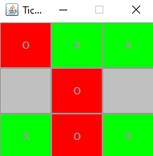

# TicTacToe

</img>

## Description
A TicTacToe Game with an inbuilt algorithm that never loses. 
I made this game in first grade of HTL in order of a an assignment. 
The GUI and the first structures were initially provided by my teacher Professor Schildberger. 
The goal was to make a playable game by just programming the backend of the game and listen to the already given mouse events. 
I extended this assignment by adding another listener for the mouse wheel and two more modes to the game where an algorithm containing switches and ifs is used to determine the next move.

## How to run the game
Right Click the executable JAR file and select "Run As" -> "Java Application" 
This game was created with simple inbuilt Java Code and compiled in Java 1.8 so you should be able to run the application without any additional libraries.

## How to play

1. The game is played on a 3x3 grid.
2. You and the computer take turns placing pieces on the grid.
3. The first player to get three of their pieces in a row wins.
4. If all 9 squares are filled and no player has 3 in a row, then the game is a draw.

## Controls
Left click to place a X. 
Right click to place a O. 
Mouse wheel to change Mode. 
Mouse wheel click to show Game Instructions. 
Mouse wheel mid game to restart the game.